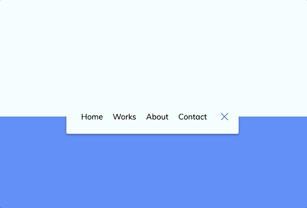

# 🚀 Animated Navigation

This is a delightful **Animated Navigation** menu built with **HTML**, **CSS**, and **JavaScript**.  
It features smooth hover and click animations that enhance user experience and bring your navigation to life.

---

## 📸 Demo

<p align="center">
  
</p>

---

##  Features
- Elegant hover and click animations  
- Smooth transitions for menu items  
- Enhances UI interactivity and engagement

---

##  Technologies Used
- HTML  
- CSS  
- JavaScript  

---

##  How to Use
1. Clone the repository:
   ```bash
   git clone https://github.com/JehanAB/AnimatedNavigation.git
